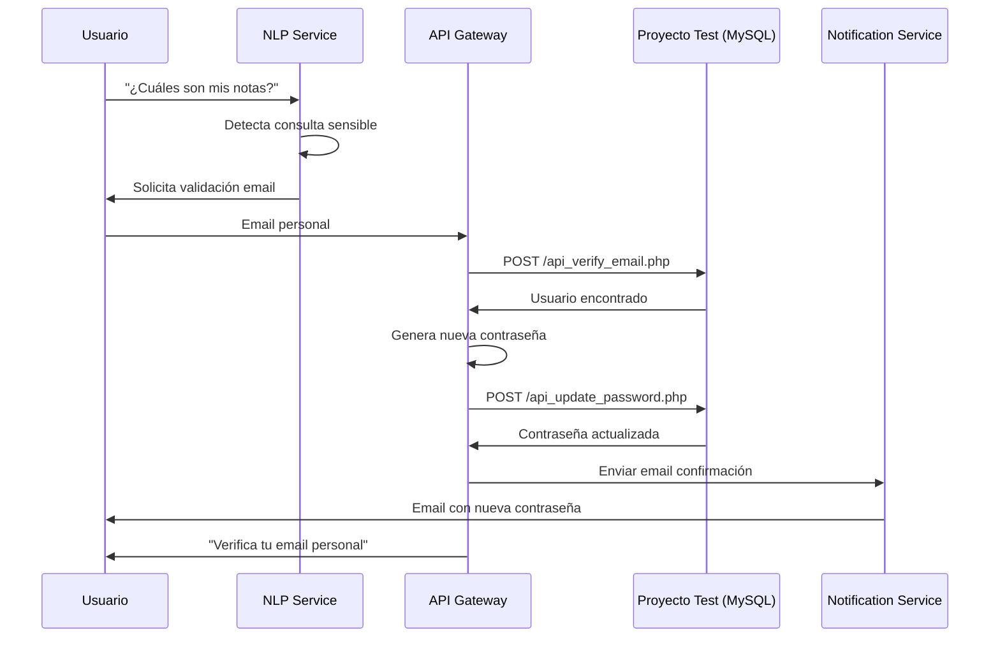

# 🔄 ACTUALIZACIÓN: Base de Datos con Email Personal (RF004)

## 📋 Resumen de Cambios

Se ha actualizado la base de datos del proyecto test para incluir el campo `email_personal` y datos de prueba que simulan usuarios reales de la UPT. Esto permite probar el **RF004 (Validación por Correo Personal)** del sistema de chat.

---

## 🗄️ Cambios en la Base de Datos

### **Tabla `usuarios` - Nuevos Campos**

```sql
ALTER TABLE usuarios ADD COLUMN:
- email_personal VARCHAR(100)        -- Email personal para recuperación
- tipo_usuario ENUM()                -- Tipo: estudiante, docente, administrativo
- codigo_universitario VARCHAR(20)   -- Código UPT único
- carrera VARCHAR(100)               -- Carrera o departamento
- estado ENUM()                      -- Estado: activo, inactivo, egresado
```

### **Datos de Prueba Insertados**

#### **Estudiantes (10 usuarios)**
| Usuario | Nombre | Email UPT | Email Personal | Carrera |
|---------|--------|-----------|----------------|---------|
| 2020068376 | Juan Carlos Pérez Mamani | 2020068376@upt.edu.pe | juanperez@gmail.com | Ing. Sistemas |
| 2021054832 | María Elena Flores Quispe | 2021054832@upt.edu.pe | mariaflores@outlook.com | Ing. Civil |
| 2019073245 | Carlos Alberto Fernández | 2019073245@upt.edu.pe | carlosfernandez@hotmail.com | Arquitectura |
| 2022081567 | Ana Lucía Torres Vargas | 2022081567@upt.edu.pe | anatorres@yahoo.com | Derecho |
| ... | ... | ... | ... | ... |

**Contraseña para todos**: `password123`

#### **Docentes (5 usuarios)**
| Usuario | Nombre | Email UPT | Email Personal |
|---------|--------|-----------|----------------|
| prof001 | Dr. José Antonio Mendoza | jmendoza@upt.pe | josemendoza@gmail.com |
| prof002 | Mg. Patricia Elena Huamán | phuaman@upt.pe | patriciahuaman@outlook.com |
| prof003 | Ing. Carlos Eduardo Pari | cpari@upt.pe | carlospari@gmail.com |
| ... | ... | ... | ... |

#### **Administrativos (3 usuarios)**
| Usuario | Nombre | Email UPT | Email Personal | Área |
|---------|--------|-----------|----------------|------|
| admin001 | Lic. Carmen Rosa López | clopez@upt.pe | carmenlopez@gmail.com | Secretaría Académica |
| admin002 | Sr. Miguel Angel Torres | mtorres@upt.pe | migueltorres@outlook.com | Soporte Técnico |
| admin003 | Lic. Gabriela Fernández | gfernandez@upt.pe | gabrielafernandez@gmail.com | Biblioteca |

---

## 🔧 Aplicar los Cambios

### **Opción 1: Script Automático**
```bash
cd /home/desci/Documentos/constru/proyectotest
./setup_database.sh
```

### **Opción 2: Manual con MySQL**
```bash
mysql -h TU_HOST -P 3306 -u TU_USER -p TU_DATABASE < database_setup.sql
```

### **Opción 3: Desde phpMyAdmin o Clever Cloud**
1. Accede a tu panel de base de datos
2. Selecciona la base de datos `upt_intranet`
3. Ve a "SQL" o "Importar"
4. Copia y pega el contenido de `database_setup.sql`
5. Ejecuta

---

## 🆕 Nuevos Métodos en el Modelo User.php

### **1. verifyEmailPersonal($email_personal)**
Verifica si existe un usuario con ese email personal.

```php
$user = new User($db);
$result = $user->verifyEmailPersonal('juanperez@gmail.com');

if ($result['exists']) {
    echo "Usuario encontrado: " . $result['nombre_completo'];
    echo "Email UPT: " . $result['email'];
    echo "Usuario: " . $result['usuario'];
}
```

**Respuesta:**
```php
[
    'exists' => true,
    'id' => 1,
    'usuario' => '2020068376',
    'nombre_completo' => 'Juan Carlos Pérez Mamani',
    'email' => '2020068376@upt.edu.pe',
    'email_personal' => 'juanperez@gmail.com'
]
```

### **2. updatePassword($usuario, $new_password)**
Actualiza la contraseña de un usuario.

```php
$user = new User($db);
$success = $user->updatePassword('2020068376', 'nuevaContraseña123');

if ($success) {
    echo "Contraseña actualizada exitosamente";
}
```

---

## 🌐 Nuevos Endpoints API

### **1. POST /public/api_verify_email.php**
Verifica si un email personal existe en la base de datos.

**Request:**
```bash
curl -X POST http://localhost:8000/public/api_verify_email.php \
  -H "Content-Type: application/json" \
  -d '{"email_personal": "juanperez@gmail.com"}'
```

**Response (200 OK):**
```json
{
  "success": true,
  "message": "Email personal encontrado",
  "data": {
    "id": 1,
    "usuario": "2020068376",
    "nombre_completo": "Juan Carlos Pérez Mamani",
    "email": "2020068376@upt.edu.pe",
    "email_personal": "juanperez@gmail.com"
  }
}
```

**Response (404 Not Found):**
```json
{
  "success": false,
  "message": "No se encontró ningún usuario con ese email personal"
}
```

---

### **2. POST /public/api_update_password.php**
Actualiza la contraseña de un usuario.

**Request:**
```bash
curl -X POST http://localhost:8000/public/api_update_password.php \
  -H "Content-Type: application/json" \
  -d '{
    "usuario": "2020068376",
    "new_password": "miNuevaContraseña123"
  }'
```

**Response (200 OK):**
```json
{
  "success": true,
  "message": "Contraseña actualizada exitosamente",
  "data": {
    "usuario": "2020068376",
    "updated_at": "2025-10-19 15:30:45"
  }
}
```

---

## 🔗 Integración con API Gateway (RF004)

### **Actualizar MySQLConnectionService**

En el API Gateway (`services/api-gateway/src/infrastructure/services/mysql-connection.service.ts`):

```typescript
// Cambiar la URL base si es necesario
private readonly phpApiBaseUrl = 'http://localhost:8000/public';

async verifyEmailPersonal(emailPersonal: string) {
  const response = await axios.post(
    `${this.phpApiBaseUrl}/api_verify_email.php`,
    { email_personal: emailPersonal }
  );
  return response.data;
}
```

### **Actualizar PasswordResetService**

```typescript
// Verificar email personal
const verifyResult = await this.mysqlConnection.verifyEmailPersonal(emailPersonal);

if (!verifyResult.success) {
  throw new NotFoundException('Email personal no encontrado en la base de datos UPT');
}

// Generar nueva contraseña
const newPassword = this.generateTemporaryPassword();

// Actualizar en MySQL
await this.mysqlConnection.updateUserPassword(
  verifyResult.data.usuario, 
  newPassword
);
```

---

## ✅ Pruebas del Sistema

### **Caso de Prueba 1: Verificar Email Personal**
```bash
# Usuario existe
curl -X POST http://localhost:8000/public/api_verify_email.php \
  -H "Content-Type: application/json" \
  -d '{"email_personal": "juanperez@gmail.com"}'

# Esperado: 200 OK con datos del usuario
```

### **Caso de Prueba 2: Email Personal No Existe**
```bash
curl -X POST http://localhost:8000/public/api_verify_email.php \
  -H "Content-Type: application/json" \
  -d '{"email_personal": "noexiste@gmail.com"}'

# Esperado: 404 Not Found
```

### **Caso de Prueba 3: Actualizar Contraseña**
```bash
curl -X POST http://localhost:8000/public/api_update_password.php \
  -H "Content-Type: application/json" \
  -d '{
    "usuario": "2020068376",
    "new_password": "nuevaPassword123"
  }'

# Esperado: 200 OK
```

### **Caso de Prueba 4: Login con Nueva Contraseña**
```bash
# Probar login en el sistema PHP
# Usuario: 2020068376
# Contraseña: nuevaPassword123
```

---

## 📊 Flujo Completo RF004



---

## 🎯 Usuarios de Prueba Recomendados

### **Para RF004 (Validación Email)**
- **Usuario**: `2020068376`
- **Contraseña**: `password123`
- **Email Personal**: `juanperez@gmail.com`
- **Email UPT**: `2020068376@upt.edu.pe`

### **Para Pruebas de Docente**
- **Usuario**: `prof001`
- **Contraseña**: `password123`
- **Email Personal**: `josemendoza@gmail.com`
- **Email UPT**: `jmendoza@upt.pe`

### **Para Pruebas de Administrativo**
- **Usuario**: `admin002`
- **Contraseña**: `password123`
- **Email Personal**: `migueltorres@outlook.com`
- **Email UPT**: `mtorres@upt.pe`

---

## 🚀 Próximos Pasos

1. ✅ **Ejecutar script SQL** para aplicar cambios
2. ✅ **Probar endpoints API** con curl o Postman
3. ✅ **Actualizar API Gateway** para usar nuevos endpoints
4. ✅ **Probar flujo completo RF004** con NLP Service
5. ✅ **Configurar Gmail SMTP** para envío de emails

---

## 📝 Notas Importantes

- Todos los usuarios tienen la contraseña: `password123`
- Los emails personales son ficticios pero con formato válido
- El campo `email_personal` acepta NULL (usuarios antiguos sin email)
- CORS está habilitado en los endpoints API para permitir llamadas desde el API Gateway
- Las contraseñas se hashean con `password_hash()` de PHP (bcrypt)

---

**Fecha de actualización**: 19 de octubre de 2025  
**Versión**: 2.0  
**Autor**: Sistema UPT Chat - Equipo de Desarrollo
