# Diagramas del Sistema UPT Chat en PlantUML

**Documento:** FD04 - Arquitectura de Software  
**Proyecto:** Sistema UPT Chat  
**Formato:** PlantUML  
**Total de Diagramas:** 21

---

## 1. Modelo 4+1 de Kruchten

```plantuml
@startuml
!define RECTANGLE class

skinparam componentStyle rectangle
skinparam backgroundColor #FFFFFF
skinparam defaultFontSize 11

package "Modelo 4+1 de Kruchten" {
    
    component "Vista Lógica\n(Logical View)" as LOGICAL #LightBlue {
        note right
            Funcionalidad del sistema
            Diagramas de clases
            Diagramas de objetos
        end note
    }
    
    component "Vista de Procesos\n(Process View)" as PROCESS #LightGreen {
        note right
            Concurrencia del sistema
            Sincronización
            Rendimiento
        end note
    }
    
    component "Vista de Desarrollo\n(Development View)" as DEVELOPMENT #LightYellow {
        note right
            Organización del software
            Gestión de módulos
            Capas del sistema
        end note
    }
    
    component "Vista Física\n(Physical View)" as PHYSICAL #LightCoral {
        note right
            Topología del sistema
            Despliegue
            Comunicación
        end note
    }
    
    component "Escenarios\n(Scenarios)" as SCENARIOS #LightGray {
        note bottom
            Casos de uso
            Integración de vistas
            Validación arquitectónica
        end note
    }
    
    SCENARIOS ..> LOGICAL
    SCENARIOS ..> PROCESS
    SCENARIOS ..> DEVELOPMENT
    SCENARIOS ..> PHYSICAL
    
    LOGICAL -[hidden]-> PROCESS
    PROCESS -[hidden]-> DEVELOPMENT
    DEVELOPMENT -[hidden]-> PHYSICAL
}

legend right
    Sistema UPT Chat
    Modelo 4+1 Views
    Kruchten Architecture
endlegend

@enduml
```

---

## 2. Arquitectura de Microservicios

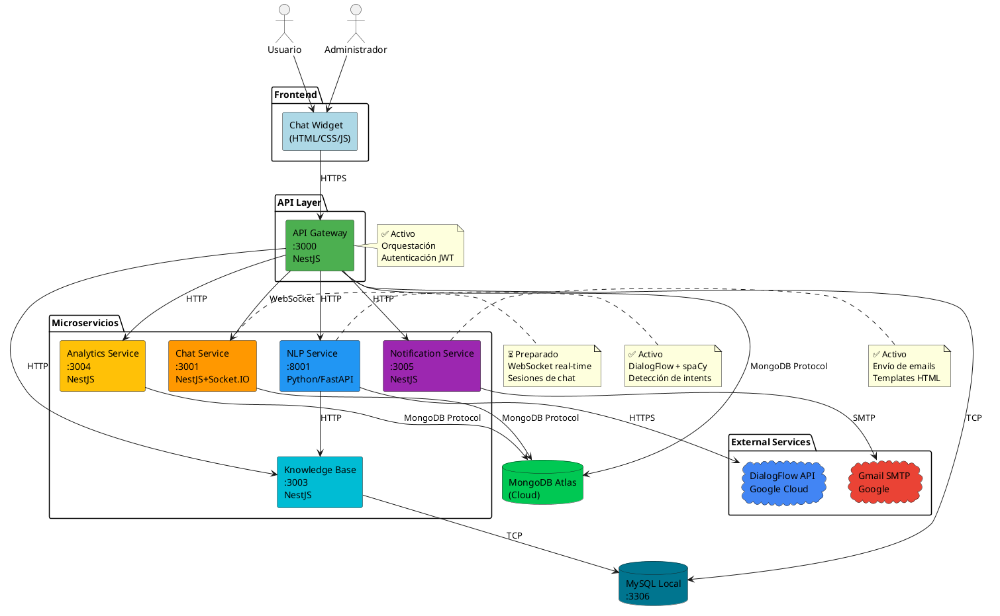

---

## 3. Clean Architecture - Capas

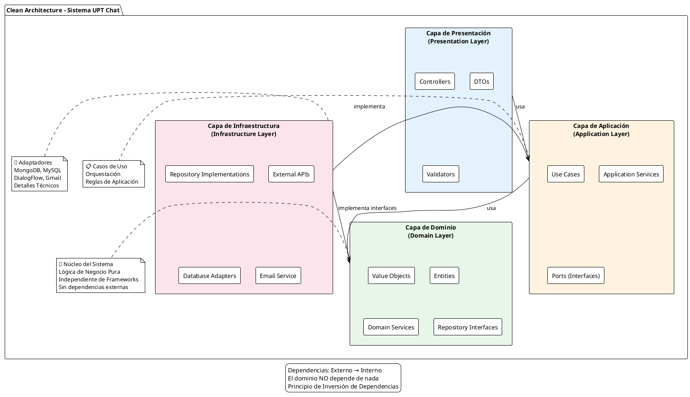

---

## 4. Diagrama de Casos de Uso General

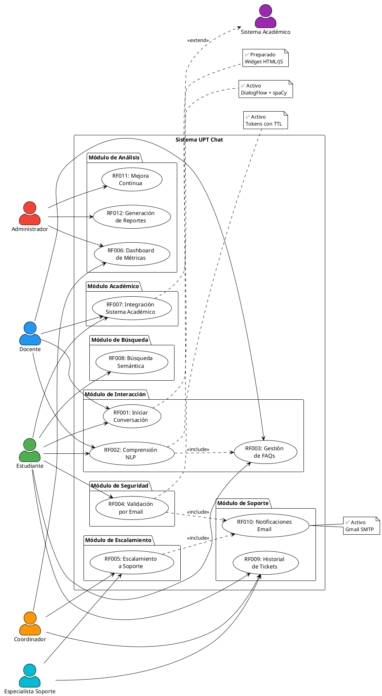

---

## 5. Arquitectura de Alto Nivel

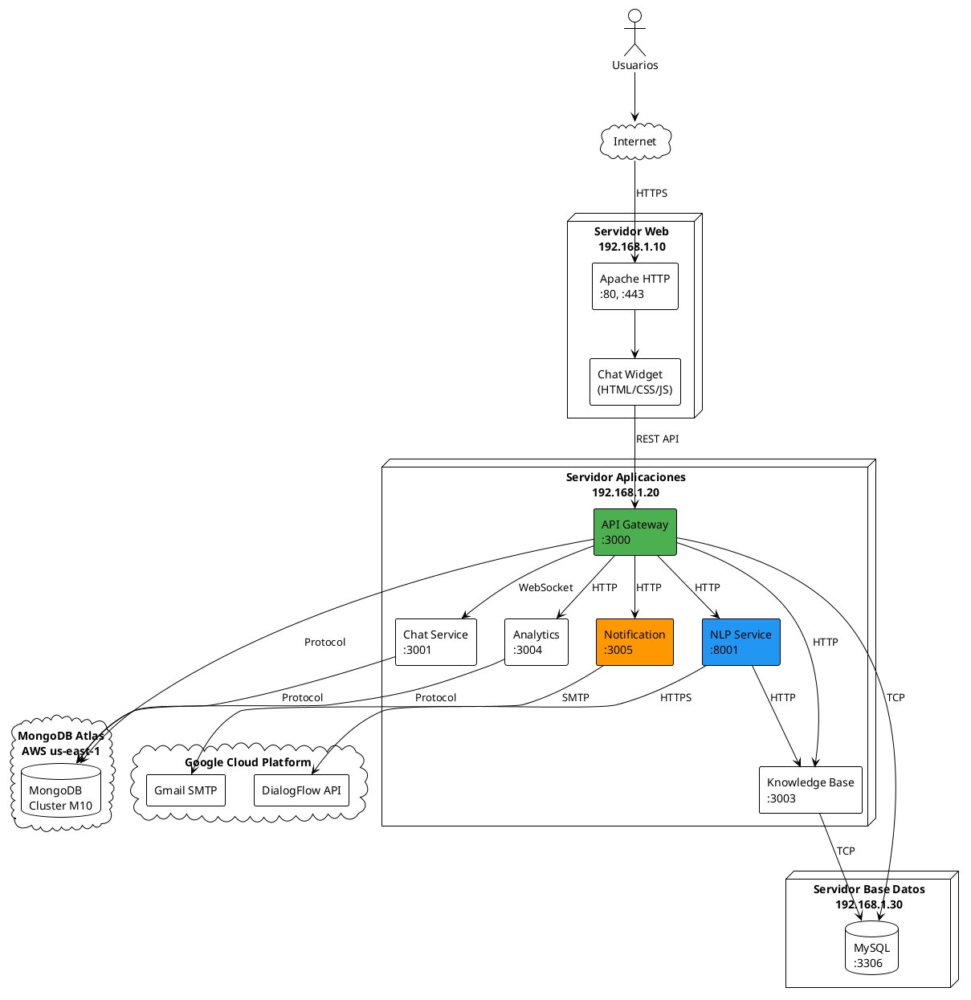

---

## 6. Diagrama de Paquetes/Subsistemas

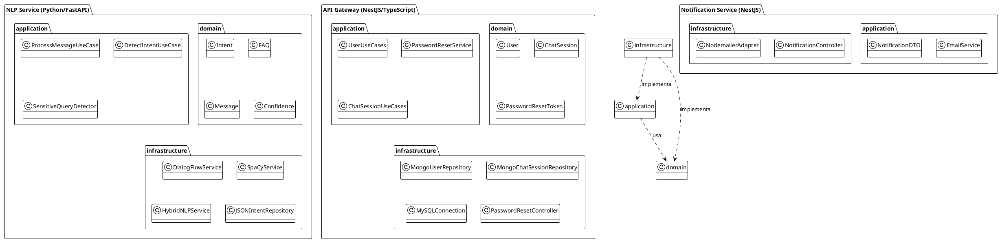

---

## 7. Secuencia RF001 - Iniciar Conversación con Widget

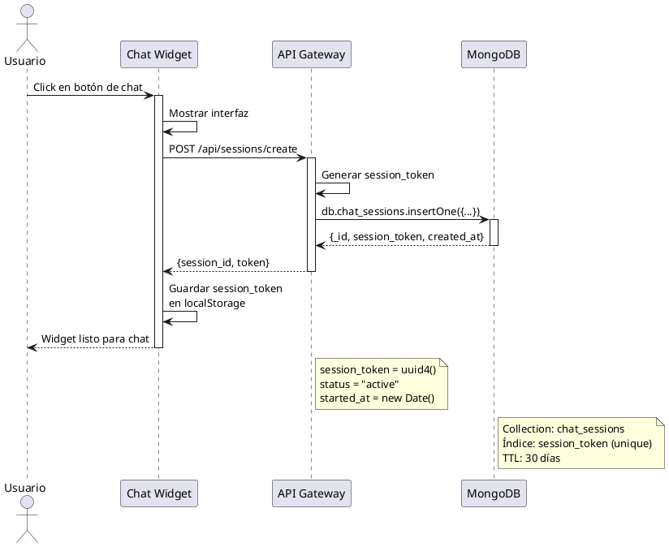

---

## 8. Secuencia RF002 - Comprensión NLP (Híbrido)

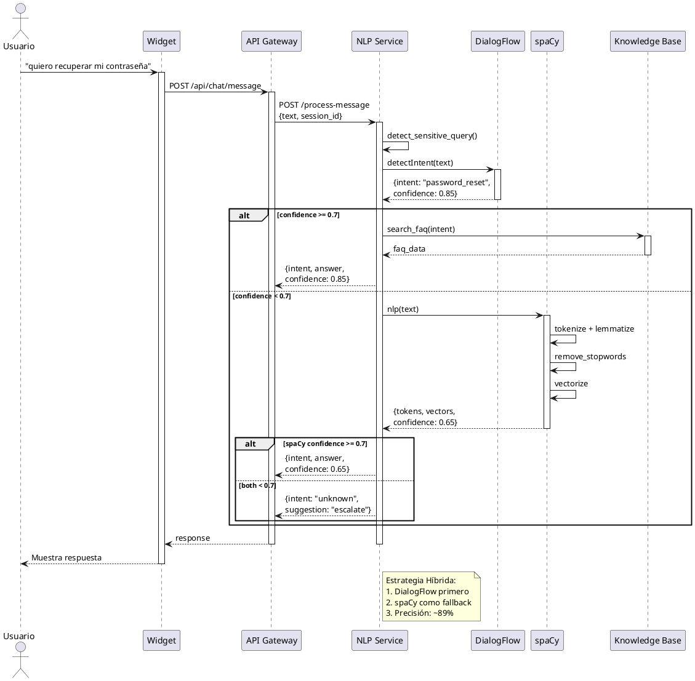

---

## 9. Secuencia RF003 - Gestión de FAQs

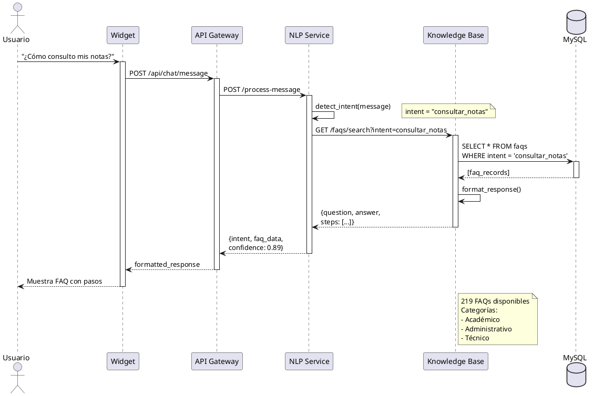

---

## 10. Secuencia RF004 - Validación por Email (IMPLEMENTADO)

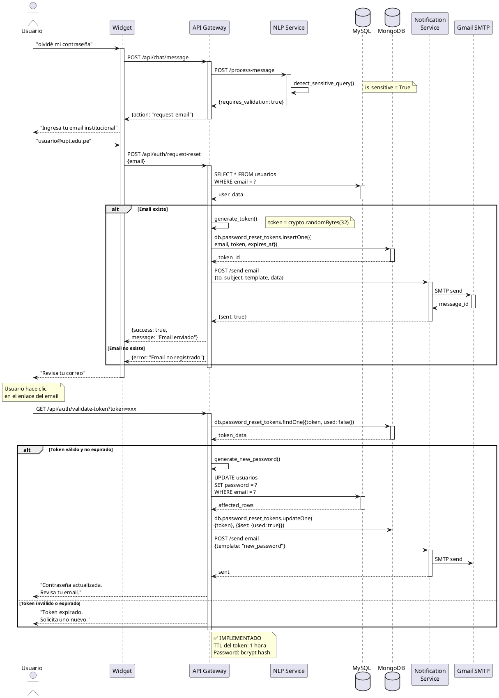

---

## 11. Secuencia RF008 - Búsqueda Semántica con Vectores

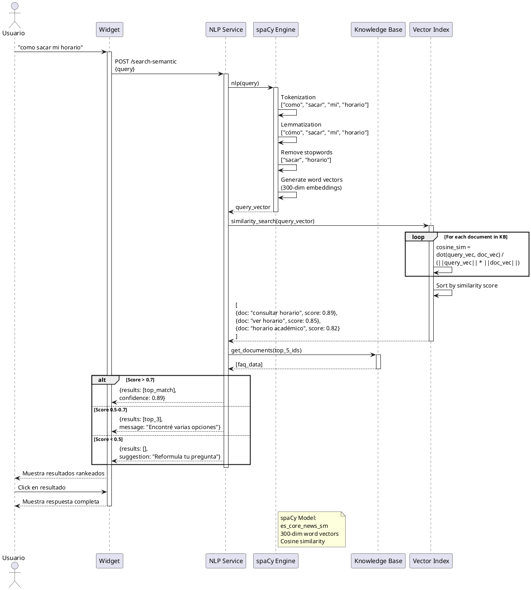

---

## 12. Diagrama de Actividades General del Sistema

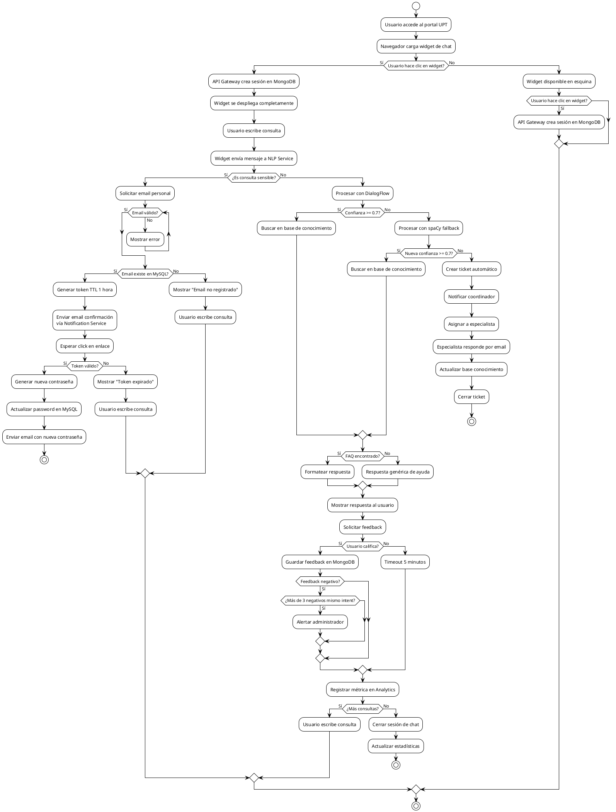

---

## 13. Diagrama de Despliegue Completo

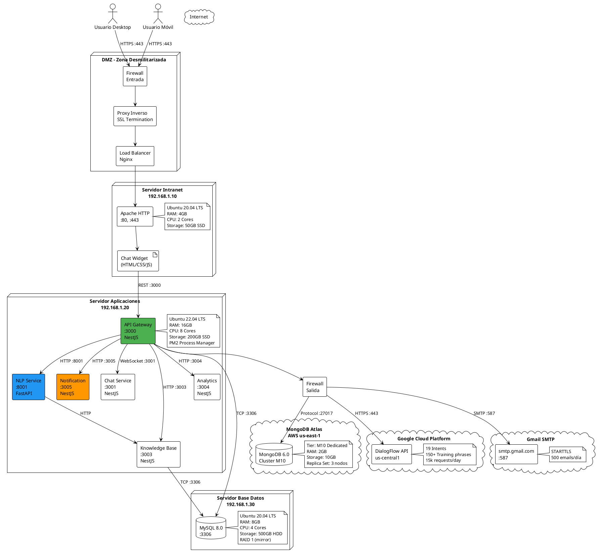

---

## 14. Diagrama de Escalamiento Horizontal

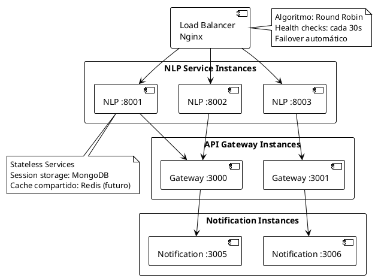

---

## 15. Esquema MongoDB

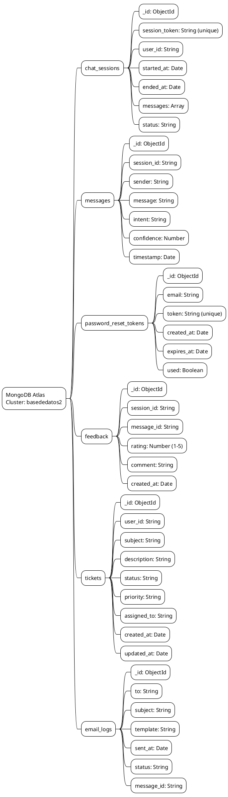

---

## 16. Esquema MySQL

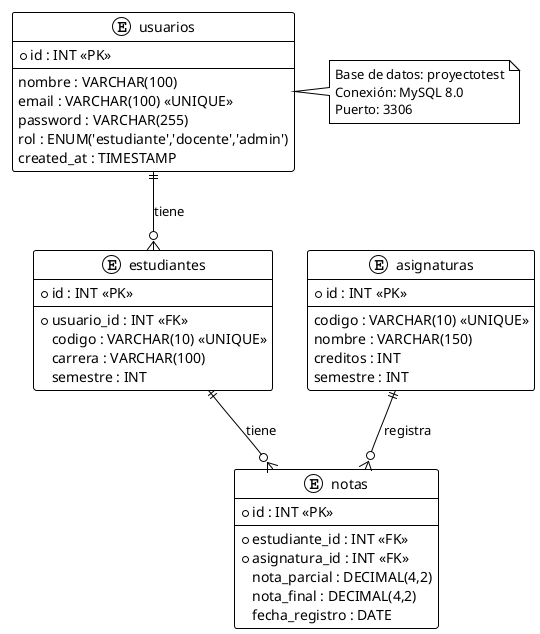

---

**FIN DEL DOCUMENTO**

**Total de diagramas:** 16 diagramas principales en PlantUML  
**Formato:** PlantUML estándar compatible con todos los renderizadores  
**Visualización:** Puede usarse en IntelliJ, VS Code (PlantUML extension), planttext.com, etc.

---

**Nota:** Estos diagramas son equivalentes a los diagramas Mermaid del documento FD04 principal, pero convertidos a sintaxis PlantUML para mayor compatibilidad y opciones de renderizado.
