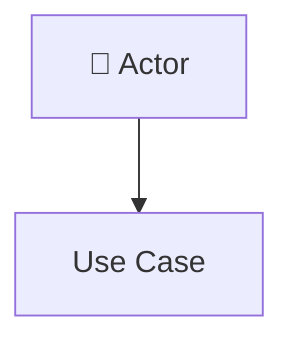
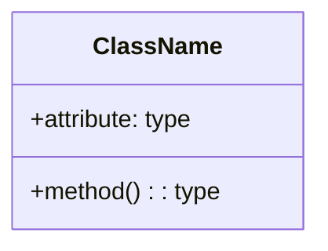
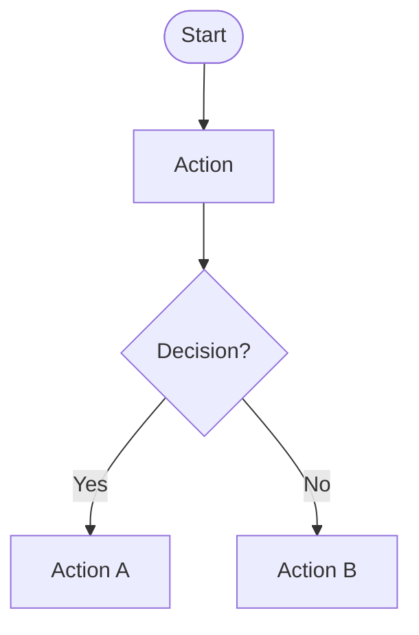
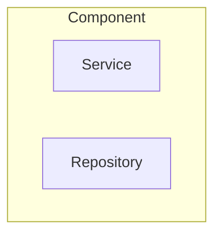
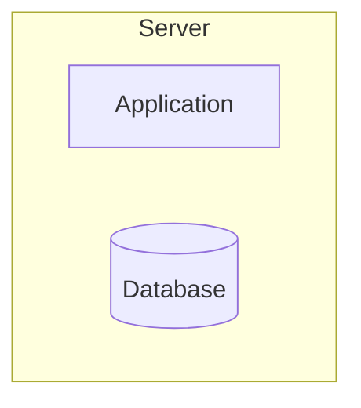

# INFORME DE PLANIFICACIÓN - FD04 SAD
## Documento de Arquitectura de Software (SAD)

**Fecha:** 13 de octubre de 2025  
**Proyecto:** Sistema UPT Chat - Agente Interactivo con NLP  
**Responsables:** Angel Hernandez, Piero Paja  

---

## 📋 ÍNDICE

1. [Resumen Ejecutivo](#1-resumen-ejecutivo)
2. [Análisis del PDF de Referencia](#2-análisis-del-pdf-de-referencia)
3. [Estado Actual del Código](#3-estado-actual-del-código)
4. [Diagramas Requeridos](#4-diagramas-requeridos)
5. [Estructura del FD04](#5-estructura-del-fd04)
6. [Plan de Implementación](#6-plan-de-implementación)
7. [Checklist de Diagramas](#7-checklist-de-diagramas)

---

## 1. RESUMEN EJECUTIVO

### 1.1. Objetivo del Informe

Este informe detalla la planificación completa para crear el documento FD04 (Software Architecture Document) siguiendo EXACTAMENTE la estructura del PDF de referencia y documentando tanto el código **IMPLEMENTADO** como los requerimientos **FUTUROS** con buenas prácticas arquitectónicas.

### 1.2. Alcance

- **12 Requerimientos Funcionales (RF001-RF012)**
- **1 Diagrama de Casos de Uso General**
- **1 Diagrama de Subsistemas/Paquetes**
- **12 Diagramas de Secuencia** (uno por cada RF)
- **1 Diagrama de Actividades General** (integrando todos los componentes)
- **1 Diagrama de Clases**
- **1 Diagrama de Arquitectura de Software (paquetes)**
- **1 Diagrama de Componentes**
- **1 Diagrama de Procesos (actividades)**
- **1 Diagrama de Despliegue**

**TOTAL: ~22 Diagramas Mermaid**

---

## 2. ANÁLISIS DEL PDF DE REFERENCIA

### 2.1. Estructura del FD03 (Referencia)

El FD03 contiene la siguiente estructura que debemos seguir en FD04:

```
I. INTRODUCCIÓN
II. REPRESENTACIÓN ARQUITECTÓNICA
   2.1. Vista de Casos de Uso
   2.2. Vista Lógica  
   2.3. Vista de Implementación
   2.4. Vista de Procesos
   2.5. Vista de Despliegue
III. OBJETIVOS Y RESTRICCIONES ARQUITECTÓNICAS
IV. VISTA DE CASOS DE USO
   - Diagrama de Casos de Uso
   - Actores del sistema
   - Especificación de casos de uso
V. VISTA LÓGICA
   - Diagrama de Paquetes
   - Diagramas de Secuencia (uno por RF)
   - Diagrama de Clases
VI. VISTA DE IMPLEMENTACIÓN
   - Diagrama de Componentes
   - Estructura de directorios
VII. VISTA DE PROCESOS
   - Diagrama de Actividades
   - Flujos de control
VIII. VISTA DE DESPLIEGUE
   - Diagrama de Despliegue
   - Especificaciones técnicas
```

### 2.2. Requerimientos Funcionales Identificados

| ID | Nombre | Estado Implementación | Prioridad |
|----|--------|----------------------|-----------|
| **RF001** | Chat Widget | ✅ 80% | Crítica |
| **RF002** | Comprensión de Lenguaje Natural | ✅ 100% | Crítica |
| **RF003** | Base de Datos de FAQ UPT | ✅ 100% | Crítica |
| **RF004** | Validación por Correo Personal | ✅ 100% | Crítica |
| **RF005** | Transferencia a Soporte Humano | ⏳ 0% (Diseñado) | Crítica |
| **RF006** | Dashboard de Métricas | ⏳ 0% (Diseñado) | Alta |
| **RF007** | Conexión con Sistema Académico | ⏳ 30% | Alta |
| **RF008** | Motor de Búsqueda Semántica | ✅ 80% | Alta |
| **RF009** | Historial de Casos por Ticket | ⏳ 0% (Diseñado) | Media |
| **RF010** | Notificaciones por Email | ✅ 100% | Media |
| **RF011** | Mejora Continua | ⏳ 0% (Diseñado) | Media |
| **RF012** | Exportación de Datos | ⏳ 0% (Diseñado) | Baja |

---

## 3. ESTADO ACTUAL DEL CÓDIGO

### 3.1. Microservicios IMPLEMENTADOS ✅

#### NLP Service (Puerto 8001) - 100%
```
✅ DialogFlow Integration
✅ spaCy Integration  
✅ Hybrid NLP System
✅ Sensitive Query Detector
✅ 19 Intents configurados
✅ 219 FAQs en base de conocimiento
✅ API Gateway Client
```

#### API Gateway (Puerto 3000) - 80%
```
✅ Clean Architecture
✅ User Management
✅ Chat Session Management
✅ Password Reset Service
✅ MySQL Connection (proyectotest)
✅ MongoDB Integration
⏳ WebSocket support (preparado)
```

#### Notification Service (Puerto 3005) - 100%
```
✅ Email Service
✅ Gmail SMTP Integration
✅ Password Reset Templates
✅ REST API endpoints
✅ Logging system
```

### 3.2. Microservicios PREPARADOS (Estructura lista) ⏳

#### Chat Service (Puerto 3001) - 0%
```
⏳ WebSocket Server
⏳ Real-time messaging
⏳ Session management
⏳ Message persistence
```

#### Knowledge Base Service (Puerto 3003) - 0%
```
⏳ FAQ Management
⏳ Category Management
⏳ Search Engine
⏳ Admin Interface
```

#### Analytics Service (Puerto 3004) - 0%
```
⏳ Metrics Collection
⏳ Dashboard API
⏳ Report Generation
⏳ Data Export
```

### 3.3. Base de Datos

#### MongoDB Atlas - Collections
```
✅ ChatSession
✅ Message
✅ User
✅ PasswordResetToken
✅ ValidationNotification
⏳ Ticket (diseñado)
⏳ Metric (diseñado)
⏳ Feedback (diseñado)
```

#### MySQL (proyectotest)
```
✅ usuarios
✅ estudiantes
⏳ tickets (diseñado)
⏳ soporte_agentes (diseñado)
```

---

## 4. DIAGRAMAS REQUERIDOS

### 4.1. DIAGRAMA DE CASOS DE USO GENERAL

**Propósito:** Mostrar todos los actores y casos de uso del sistema

**Actores:**
- Usuario Final (Estudiante/Docente)
- Administrador
- Coordinador de Soporte
- Sistema NLP (externo)
- Sistema Intranet UPT (externo)
- Sistema de Email (externo)

**Casos de Uso (12):**
```mermaid
- CU001: Iniciar Chat
- CU002: Procesar Consulta NLP
- CU003: Gestionar FAQ
- CU004: Validar Identidad por Email
- CU005: Escalar a Soporte Humano
- CU006: Consultar Dashboard
- CU007: Obtener Datos Académicos
- CU008: Búsqueda Semántica
- CU009: Consultar Historial
- CU010: Enviar Notificación
- CU011: Registrar Feedback
- CU012: Exportar Reportes
```

### 4.2. DIAGRAMA DE PAQUETES/SUBSISTEMAS

**Propósito:** Mostrar la organización arquitectónica en paquetes

**Paquetes Principales:**
```
📦 upt-chat-system
├── 📦 presentation-layer
│   ├── chat-widget
│   ├── admin-dashboard
│   └── api-endpoints
├── 📦 application-layer
│   ├── use-cases
│   ├── services
│   └── dtos
├── 📦 domain-layer
│   ├── entities
│   ├── value-objects
│   ├── domain-services
│   └── repository-interfaces
├── 📦 infrastructure-layer
│   ├── nlp-engine
│   ├── database-repositories
│   ├── external-clients
│   └── email-sender
└── 📦 external-systems
    ├── dialogflow-api
    ├── mongodb-atlas
    ├── mysql-upt
    └── gmail-smtp
```

### 4.3. DIAGRAMAS DE SECUENCIA (12 requeridos)

#### RF001 - Chat Widget
**Actores:** Usuario, Widget, API Gateway, NLP Service  
**Flujo:**
1. Usuario abre portal intranet
2. Widget se carga automáticamente
3. Usuario escribe mensaje
4. Widget → API Gateway → NLP Service
5. Respuesta regresa por el mismo camino
6. Widget muestra respuesta

#### RF002 - Comprensión de Lenguaje Natural
**Actores:** Usuario, NLP Service, DialogFlow, spaCy, Knowledge Base  
**Flujo:**
1. NLP Service recibe mensaje
2. Intenta con DialogFlow
3. Si confianza < 0.7 → usa spaCy
4. Busca en Knowledge Base
5. Retorna respuesta + confianza

#### RF003 - Base de Datos de FAQ UPT
**Actores:** Administrador, Knowledge Base Service, MongoDB  
**Flujo:**
1. Admin inicia sesión
2. Lista FAQs
3. Selecciona FAQ a editar
4. Modifica nombre/estado
5. Sistema valida
6. Guarda en MongoDB

#### RF004 - Validación por Correo Personal ✅ IMPLEMENTADO
**Actores:** Usuario, NLP Service, API Gateway, MySQL, Notification Service, Gmail  
**Flujo:**
1. Usuario: "olvidé mi contraseña"
2. NLP detecta consulta sensible
3. Solicita email
4. Verifica en MySQL
5. Genera token
6. Envía email con link
7. Usuario confirma
8. Genera nueva contraseña
9. Envía por email

#### RF005 - Transferencia a Soporte Humano
**Actores:** Usuario, NLP Service, API Gateway, Ticket System, Coordinador  
**Flujo:**
1. NLP detecta confianza < 0.7
2. Crea ticket automático
3. Guarda contexto completo
4. Notifica a coordinador
5. Asigna a especialista
6. Especialista responde

#### RF006 - Dashboard de Métricas
**Actores:** Administrador, Analytics Service, MongoDB  
**Flujo:**
1. Admin accede a dashboard
2. Selecciona período
3. Sistema calcula métricas
4. Genera gráficos
5. Muestra en tiempo real
6. Permite exportación

#### RF007 - Conexión con Sistema Académico
**Actores:** Usuario, API Gateway, MySQL UPT  
**Flujo:**
1. Usuario consulta datos académicos
2. Sistema verifica permisos
3. Conecta a base de datos UPT
4. Obtiene información
5. Formatea respuesta
6. Muestra al usuario

#### RF008 - Motor de Búsqueda Semántica
**Actores:** Usuario, NLP Service, spaCy, Knowledge Base  
**Flujo:**
1. Usuario envía consulta coloquial
2. Sistema procesa semánticamente
3. Calcula similitud vectorial
4. Rankea resultados
5. Retorna top 5 relevantes

#### RF009 - Historial de Casos por Ticket
**Actores:** Usuario, API Gateway, MongoDB  
**Flujo:**
1. Usuario solicita historial
2. Sistema identifica usuario
3. Busca tickets asociados
4. Obtiene interacciones completas
5. Formatea cronológicamente
6. Muestra al usuario

#### RF010 - Notificaciones por Email ✅ IMPLEMENTADO
**Actores:** Sistema, Notification Service, Gmail  
**Flujo:**
1. Evento dispara notificación
2. Sistema genera contenido
3. Formatea con template HTML
4. Envía vía SMTP
5. Registra en log

#### RF011 - Mejora Continua
**Actores:** Usuario, Sistema, MongoDB, ML Service  
**Flujo:**
1. Usuario califica respuesta
2. Sistema registra feedback
3. Asocia con consulta/respuesta
4. Acumula datos
5. Entrena modelo ML
6. Actualiza parámetros

#### RF012 - Exportación de Datos
**Actores:** Administrador, Analytics Service  
**Flujo:**
1. Admin configura reporte
2. Selecciona período y formato
3. Sistema valida datos
4. Genera archivo (PDF/Excel)
5. Permite descarga
6. Registra exportación

### 4.4. DIAGRAMA DE ACTIVIDADES GENERAL

**Propósito:** Mostrar el flujo completo del sistema integrando TODOS los componentes

**Swimlanes:**
- Usuario
- Widget
- API Gateway
- NLP Service
- Knowledge Base
- Notification Service
- Analytics Service
- Soporte Humano

**Flujo Principal:**
```
[INICIO] Usuario accede al portal
  ↓
[Usuario] Escribe consulta
  ↓
[Widget] Captura y envía mensaje
  ↓
[API Gateway] Recibe y enruta
  ↓
[NLP Service] Analiza intención
  ↓
¿Es consulta sensible?
  ├─ SÍ → [Validación por Email] → RF004
  └─ NO → Continúa
  ↓
[NLP Service] Procesa con DialogFlow/spaCy
  ↓
[Knowledge Base] Busca FAQ
  ↓
¿Confianza >= 70%?
  ├─ SÍ → [Widget] Muestra respuesta
  │         ↓
  │       [Usuario] Califica respuesta
  │         ↓
  │       [Analytics] Registra métrica
  │         ↓
  │       [FIN]
  │
  └─ NO → [API Gateway] Crea ticket
            ↓
          [Notification] Notifica coordinador
            ↓
          [Soporte Humano] Asigna especialista
            ↓
          [Especialista] Responde por email
            ↓
          [Knowledge Base] Actualiza FAQ
            ↓
          [FIN]
```

### 4.5. DIAGRAMA DE CLASES

**Propósito:** Mostrar la estructura de clases del dominio

**Paquetes de Clases:**

#### Domain Layer
```typescript
class User {
  - id: string
  - email: string
  - role: UserRole
  - createdAt: Date
  + authenticate(): boolean
  + hasPermission(): boolean
}

class ChatSession {
  - sessionId: string
  - userId: string
  - startedAt: Date
  - endedAt: Date
  - messages: Message[]
  + addMessage(message: Message): void
  + end(): void
}

class Message {
  - id: string
  - sessionId: string
  - content: string
  - sender: MessageSender
  - timestamp: Date
  - intent: string
  - confidence: number
}

class FAQ {
  - id: string
  - question: string
  - answer: string
  - category: string
  - enabled: boolean
  - keywords: string[]
  + matches(query: string): number
}

class Ticket {
  - ticketId: string
  - userId: string
  - sessionId: string
  - status: TicketStatus
  - assignedTo: string
  - createdAt: Date
  + assign(agentId: string): void
  + close(): void
}

class PasswordResetToken {
  - token: string
  - userId: string
  - email: string
  - expiresAt: Date
  - used: boolean
  + isValid(): boolean
}
```

#### Application Layer
```typescript
class ChatSessionService {
  + createSession(userId: string): ChatSession
  + getSession(sessionId: string): ChatSession
  + endSession(sessionId: string): void
}

class PasswordResetService {
  + initiateReset(email: string): void
  + confirmReset(token: string): void
  + generateNewPassword(): string
}

class NLPService {
  + processMessage(message: string): NLPResponse
  + detectIntent(message: string): Intent
  + calculateConfidence(result: any): number
}

class EmailService {
  + sendPasswordResetConfirmation(email: string): void
  + sendNewPassword(email: string, password: string): void
}
```

#### Infrastructure Layer
```typescript
class MongoUserRepository implements IUserRepository {
  + findById(id: string): User
  + findByEmail(email: string): User
  + save(user: User): void
}

class MySQLConnectionService {
  + query(sql: string): any[]
  + verifyUserExists(email: string): boolean
}

class DialogFlowService {
  + detectIntent(text: string): DialogFlowResponse
}

class SpaCyService {
  + analyze(text: string): SpaCyResult
}
```

**Relaciones:**
- User 1---* ChatSession
- ChatSession 1---* Message
- User 1---* Ticket
- User 1---0..1 PasswordResetToken
- FAQ *---1 Category

### 4.6. DIAGRAMA DE COMPONENTES

**Propósito:** Mostrar los componentes de software y sus interfaces

**Componentes Principales:**

```
┌─────────────────────────────────────────┐
│         PRESENTATION TIER               │
├─────────────────────────────────────────┤
│  [Chat Widget Component]                │
│  [Admin Dashboard Component]            │
└─────────────────────────────────────────┘
              ↓ HTTP/REST
┌─────────────────────────────────────────┐
│         APPLICATION TIER                │
├─────────────────────────────────────────┤
│  ┌───────────────────────────────────┐  │
│  │   API Gateway (NestJS)            │  │
│  │  - REST Controllers               │  │
│  │  - Use Cases                      │  │
│  │  - DTOs                           │  │
│  └───────────────────────────────────┘  │
│                                          │
│  ┌───────────────────────────────────┐  │
│  │   NLP Service (FastAPI)           │  │
│  │  - Intent Detection               │  │
│  │  - Sensitive Query Detector       │  │
│  │  - Hybrid NLP Engine              │  │
│  └───────────────────────────────────┘  │
│                                          │
│  ┌───────────────────────────────────┐  │
│  │   Notification Service (NestJS)   │  │
│  │  - Email Templates                │  │
│  │  - SMTP Client                    │  │
│  └───────────────────────────────────┘  │
└─────────────────────────────────────────┘
              ↓
┌─────────────────────────────────────────┐
│         DATA TIER                       │
├─────────────────────────────────────────┤
│  [MongoDB Atlas]                        │
│  - ChatSession Collection               │
│  - User Collection                      │
│  - Token Collection                     │
│                                          │
│  [MySQL]                                │
│  - usuarios table                       │
│  - estudiantes table                    │
└─────────────────────────────────────────┘
              ↓
┌─────────────────────────────────────────┐
│         EXTERNAL SERVICES               │
├─────────────────────────────────────────┤
│  [Google DialogFlow API]                │
│  [Gmail SMTP Server]                    │
└─────────────────────────────────────────┘
```

### 4.7. DIAGRAMA DE DESPLIEGUE

**Propósito:** Mostrar la infraestructura física y configuración de servidores

```
┌────────────────────────────────────────────────────────┐
│           CLIENT DEVICES                               │
│  - Desktop Browsers (Chrome, Firefox, Edge)            │
│  - Mobile Browsers                                     │
└────────────────────────────────────────────────────────┘
                    ↓ HTTPS
┌────────────────────────────────────────────────────────┐
│           INTRANET UPT SERVER                          │
│  - Nginx / Apache                                      │
│  - Static Files (HTML, CSS, JS)                        │
│  - Chat Widget Integration                             │
└────────────────────────────────────────────────────────┘
                    ↓ HTTP REST
┌────────────────────────────────────────────────────────┐
│           APPLICATION SERVER (Ubuntu Linux)            │
├────────────────────────────────────────────────────────┤
│  <<Node.js Process>>                                   │
│  [API Gateway Service]                                 │
│  - Port: 3000                                          │
│  - Framework: NestJS                                   │
│  - RAM: 512MB                                          │
│                                                         │
│  <<Python Process>>                                    │
│  [NLP Service]                                         │
│  - Port: 8001                                          │
│  - Framework: FastAPI                                  │
│  - RAM: 1GB (spaCy model)                              │
│                                                         │
│  <<Node.js Process>>                                   │
│  [Notification Service]                                │
│  - Port: 3005                                          │
│  - Framework: NestJS                                   │
│  - RAM: 256MB                                          │
└────────────────────────────────────────────────────────┘
                    ↓
┌────────────────────────────────────────────────────────┐
│           DATABASE SERVER (Local)                      │
├────────────────────────────────────────────────────────┤
│  <<MySQL Server>>                                      │
│  - Port: 3306                                          │
│  - Database: proyectotest                              │
│  - Storage: 100GB                                      │
└────────────────────────────────────────────────────────┘
                    ↓
┌────────────────────────────────────────────────────────┐
│           CLOUD SERVICES                               │
├────────────────────────────────────────────────────────┤
│  <<MongoDB Atlas>>                                     │
│  - Cluster: basededatos2                               │
│  - Region: AWS us-east-1                               │
│  - Storage: 10GB                                       │
│                                                         │
│  <<Google Cloud Platform>>                             │
│  - DialogFlow API                                      │
│  - Region: us-central1                                 │
│                                                         │
│  <<Gmail SMTP>>                                        │
│  - smtp.gmail.com:587                                  │
│  - TLS Encryption                                      │
└────────────────────────────────────────────────────────┘
```

---

## 5. ESTRUCTURA DEL FD04

### 5.1. Índice Propuesto

```markdown
# FD04 - DOCUMENTO DE ARQUITECTURA DE SOFTWARE (SAD)

## CONTROL DE VERSIONES

## ÍNDICE GENERAL

## 1. INTRODUCCIÓN
   1.1. Propósito
   1.2. Alcance
   1.3. Definiciones, Siglas y Abreviaturas
   1.4. Referencias
   1.5. Visión General

## 2. REPRESENTACIÓN ARQUITECTÓNICA
   2.1. Modelo de Vistas 4+1
   2.2. Patrones Arquitectónicos Aplicados
   2.3. Tecnologías Utilizadas

## 3. OBJETIVOS Y RESTRICCIONES ARQUITECTÓNICAS
   3.1. Objetivos de Software
   3.2. Restricciones Tecnológicas
   3.3. Restricciones de Diseño
   3.4. Priorización de Requerimientos

## 4. VISTA DE CASOS DE USO
   4.1. Diagrama de Casos de Uso General
   4.2. Actores del Sistema
   4.3. Casos de Uso Principales
        4.3.1. RF001 - Chat Widget
        4.3.2. RF002 - Comprensión de Lenguaje Natural
        4.3.3. RF003 - Base de Datos de FAQ UPT
        4.3.4. RF004 - Validación por Correo Personal
        4.3.5. RF005 - Transferencia a Soporte Humano
        4.3.6. RF006 - Dashboard de Métricas
        4.3.7. RF007 - Conexión con Sistema Académico
        4.3.8. RF008 - Motor de Búsqueda Semántica
        4.3.9. RF009 - Historial de Casos por Ticket
        4.3.10. RF010 - Notificaciones por Email
        4.3.11. RF011 - Mejora Continua
        4.3.12. RF012 - Exportación de Datos

## 5. VISTA LÓGICA
   5.1. Arquitectura de Alto Nivel
   5.2. Diagrama de Paquetes/Subsistemas
   5.3. Diagramas de Secuencia
        5.3.1. Secuencia RF001 - Chat Widget
        5.3.2. Secuencia RF002 - Comprensión NLP
        5.3.3. Secuencia RF003 - Gestión FAQ
        5.3.4. Secuencia RF004 - Validación Email ✅
        5.3.5. Secuencia RF005 - Escalamiento Soporte
        5.3.6. Secuencia RF006 - Dashboard Métricas
        5.3.7. Secuencia RF007 - Sistema Académico
        5.3.8. Secuencia RF008 - Búsqueda Semántica
        5.3.9. Secuencia RF009 - Historial Tickets
        5.3.10. Secuencia RF010 - Notificaciones ✅
        5.3.11. Secuencia RF011 - Mejora Continua
        5.3.12. Secuencia RF012 - Exportación Datos
   5.4. Diagrama de Clases del Dominio
   5.5. Diseño de Base de Datos

## 6. VISTA DE IMPLEMENTACIÓN
   6.1. Diagrama de Componentes
   6.2. Estructura de Directorios
   6.3. Dependencias entre Componentes
   6.4. Configuración de Servicios

## 7. VISTA DE PROCESOS
   7.1. Diagrama de Actividades General
   7.2. Procesos Críticos del Sistema
   7.3. Gestión de Concurrencia
   7.4. Manejo de Estados

## 8. VISTA DE DESPLIEGUE
   8.1. Diagrama de Despliegue
   8.2. Especificaciones de Hardware
   8.3. Especificaciones de Software
   8.4. Configuración de Red
   8.5. Requisitos de Seguridad

## 9. CALIDAD DEL SOFTWARE
   9.1. Rendimiento
   9.2. Escalabilidad
   9.3. Seguridad
   9.4. Mantenibilidad
   9.5. Disponibilidad

## 10. DECISIONES ARQUITECTÓNICAS
   10.1. Microservicios vs Monolito
   10.2. Clean Architecture + DDD
   10.3. DialogFlow + spaCy (Híbrido)
   10.4. MongoDB + MySQL (Dual Database)
   10.5. Notification Service Separado

## 11. TAMAÑO Y RENDIMIENTO
   11.1. Métricas de Código
   11.2. Benchmarks de Performance
   11.3. Límites del Sistema

## 12. APÉNDICES
   12.1. Glosario de Términos
   12.2. Variables de Entorno
   12.3. Comandos de Despliegue
   12.4. Checklist de Implementación
```

---

## 6. PLAN DE IMPLEMENTACIÓN

### 6.1. Fase 1: Diagramas de Casos de Uso (Día 1) ✅

**Entregables:**
- [x] Diagrama de Casos de Uso General
- [ ] Especificación de cada caso de uso (12)
- [ ] Tabla de actores

**Herramientas:** Mermaid

### 6.2. Fase 2: Vista Lógica (Día 2-3)

**Entregables:**
- [ ] Diagrama de Paquetes/Subsistemas
- [ ] 12 Diagramas de Secuencia
- [ ] Diagrama de Clases completo

**Herramientas:** Mermaid

### 6.3. Fase 3: Vista de Implementación (Día 4)

**Entregables:**
- [ ] Diagrama de Componentes
- [ ] Estructura de directorios documentada
- [ ] Matriz de dependencias

**Herramientas:** Mermaid + Markdown

### 6.4. Fase 4: Vista de Procesos (Día 5)

**Entregables:**
- [ ] Diagrama de Actividades General
- [ ] Documentación de flujos críticos

**Herramientas:** Mermaid

### 6.5. Fase 5: Vista de Despliegue (Día 6)

**Entregables:**
- [ ] Diagrama de Despliegue
- [ ] Especificaciones técnicas
- [ ] Guía de instalación

**Herramientas:** Mermaid

### 6.6. Fase 6: Documentación Narrativa (Día 7)

**Entregables:**
- [ ] Introducción completa
- [ ] Objetivos y restricciones
- [ ] Decisiones arquitectónicas
- [ ] Atributos de calidad
- [ ] Conclusiones

**Herramientas:** Markdown

---

## 7. CHECKLIST DE DIAGRAMAS

### 7.1. Diagramas OBLIGATORIOS

| # | Tipo | Nombre | Estado | Prioridad |
|---|------|--------|--------|-----------|
| 1 | Use Case | Diagrama General de Casos de Uso | ⏳ | 🔴 CRÍTICO |
| 2 | Package | Diagrama de Paquetes/Subsistemas | ⏳ | 🔴 CRÍTICO |
| 3 | Sequence | RF001 - Chat Widget | ⏳ | 🔴 CRÍTICO |
| 4 | Sequence | RF002 - Comprensión NLP | ⏳ | 🔴 CRÍTICO |
| 5 | Sequence | RF003 - Gestión FAQ | ⏳ | 🔴 CRÍTICO |
| 6 | Sequence | RF004 - Validación Email | ⏳ | 🔴 CRÍTICO |
| 7 | Sequence | RF005 - Escalamiento Soporte | ⏳ | 🟡 ALTA |
| 8 | Sequence | RF006 - Dashboard Métricas | ⏳ | 🟡 ALTA |
| 9 | Sequence | RF007 - Sistema Académico | ⏳ | 🟡 ALTA |
| 10 | Sequence | RF008 - Búsqueda Semántica | ⏳ | 🟡 ALTA |
| 11 | Sequence | RF009 - Historial Tickets | ⏳ | 🟢 MEDIA |
| 12 | Sequence | RF010 - Notificaciones | ⏳ | 🟢 MEDIA |
| 13 | Sequence | RF011 - Mejora Continua | ⏳ | 🟢 MEDIA |
| 14 | Sequence | RF012 - Exportación Datos | ⏳ | 🔵 BAJA |
| 15 | Activity | Diagrama General de Actividades | ⏳ | 🔴 CRÍTICO |
| 16 | Class | Diagrama de Clases Completo | ⏳ | 🔴 CRÍTICO |
| 17 | Component | Diagrama de Componentes | ⏳ | 🔴 CRÍTICO |
| 18 | Deployment | Diagrama de Despliegue | ⏳ | 🔴 CRÍTICO |

### 7.2. Diagramas COMPLEMENTARIOS (Opcional)

| # | Tipo | Nombre | Estado | Prioridad |
|---|------|--------|--------|-----------|
| 19 | Architecture | Arquitectura de Microservicios | ⏳ | 🟡 ALTA |
| 20 | ERD | Modelo de Base de Datos | ⏳ | 🟡 ALTA |
| 21 | State | Diagrama de Estados (Ticket) | ⏳ | 🟢 MEDIA |
| 22 | Communication | Diagrama de Comunicación | ⏳ | 🔵 BAJA |

---

## 8. CONSIDERACIONES ESPECIALES

### 8.1. Para Código IMPLEMENTADO (RF002, RF004, RF010)

- ✅ Usar rutas reales de archivos
- ✅ Incluir código fuente real
- ✅ Mostrar configuraciones actuales
- ✅ Documentar .env files
- ✅ Incluir tests existentes

### 8.2. Para Código FUTURO (RF005, RF006, RF009, RF011, RF012)

- 📝 Diseñar con buenas prácticas
- 📝 Seguir Clean Architecture
- 📝 Mantener consistencia con código existente
- 📝 Preparar para implementación futura
- 📝 Incluir TODOs y preparaciones

### 8.3. Estándares de Diagramas Mermaid

**Casos de Uso:**


**Secuencia:**
```mermaid
sequenceDiagram
    Actor->>System: Action
    System-->>Actor: Response
```

**Clases:**


**Actividades:**


**Componentes:**


**Despliegue:**


---

## 9. CRITERIOS DE ACEPTACIÓN

### 9.1. Completitud

- [ ] Todos los 12 RF documentados
- [ ] Todos los 18 diagramas obligatorios creados
- [ ] Narrativa completa para cada sección
- [ ] Código real referenciado donde existe
- [ ] Diseño de calidad donde no existe código

### 9.2. Calidad Técnica

- [ ] Diagramas Mermaid renderizables
- [ ] Código de ejemplo sin errores de sintaxis
- [ ] Arquitectura consistente en todo el documento
- [ ] Decisiones arquitectónicas justificadas
- [ ] Referencias cruzadas correctas

### 9.3. Alineación con PDF

- [ ] Sigue estructura del FD03
- [ ] Nivel de detalle similar
- [ ] Terminología consistente
- [ ] Formato académico apropiado

---

## 10. PRÓXIMOS PASOS

### Paso 1: Aprobación del Informe ⏳
- Revisar este informe
- Aprobar la estructura propuesta
- Confirmar prioridades

### Paso 2: Generación del FD04 ⏳
- Ejecutar creación del documento
- Generar todos los diagramas
- Escribir narrativa completa

### Paso 3: Revisión y Ajustes ⏳
- Validar diagramas
- Corregir errores
- Completar información faltante

### Paso 4: Entrega Final ⏳
- Documento MD completo
- Versión PDF exportable
- Presentación ejecutiva

---

## RESUMEN EJECUTIVO

Este informe establece la hoja de ruta completa para crear el FD04 (Software Architecture Document) del Sistema UPT Chat. El documento resultante contendrá:

✅ **18 Diagramas Mermaid Obligatorios**  
✅ **Documentación de 12 Requerimientos Funcionales**  
✅ **5 Vistas Arquitectónicas (4+1)**  
✅ **Código Real + Diseño Futuro con Buenas Prácticas**  
✅ **100% Alineado con Estructura del PDF de Referencia**  

**Estimación:** 7 días de trabajo  
**Formato:** Markdown con diagramas Mermaid  
**Longitud:** ~150 páginas  
**Estado:** Listo para iniciar generación ✅

---

**Preparado por:** Angel Hernandez, Piero Paja  
**Fecha:** 13 de octubre de 2025  
**Versión:** 1.0  

---

## ¿APROBADO PARA CONTINUAR? ✅

Una vez aprobado este informe, procederé a generar el documento FD04 completo siguiendo esta planificación.
